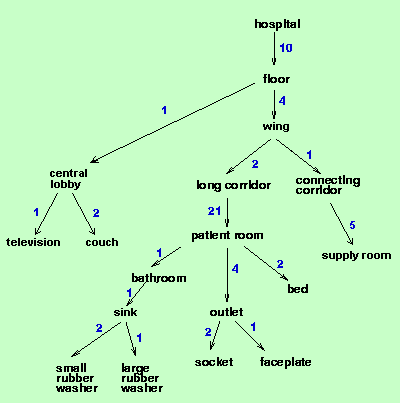

# 实验三 二叉树的基本应用

## 完成如下应用

使用树结构存储如下图所示的医院楼房结构



医院楼房树形结构

---
该结构应该是通过读取文件`definition.txt`文件创建，格式如`hospital 10 floor`，表示`hospital`有10层`floor`。将树形结构创建后，可以读取queries.txt中的查询完成对应的操作。操作有两种：`whatis connecting_corridor`意思是查询`connecting_corridor`有几个子部件。比如在该图中，`connecting_corridor`含有5个`supply room`，则打印出:

```text
Part long_corridor subparts are:
  21 patient_room
Part floor subparts are:
  4 wing
1 central_lobby
```

`howmany floor hospital`是查询`hospital`有几个`floor`，那么打印:

```text
Hospital has 10 floor
```
